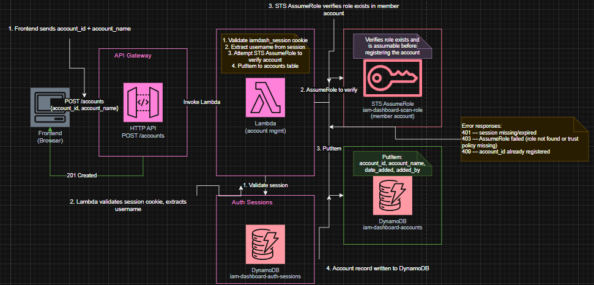
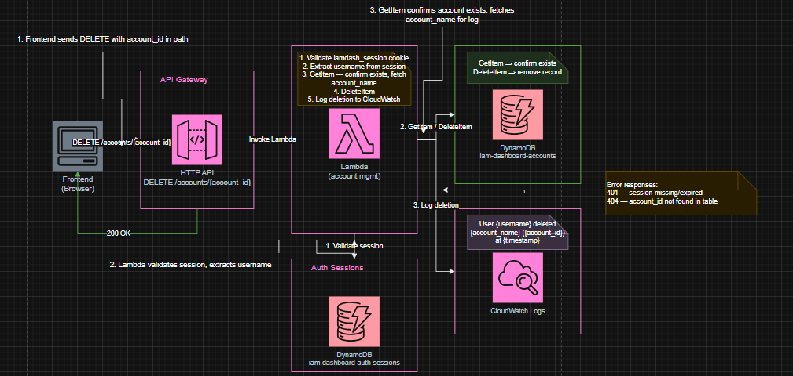
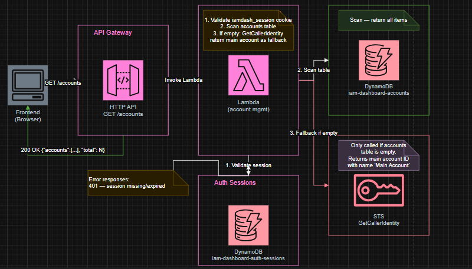
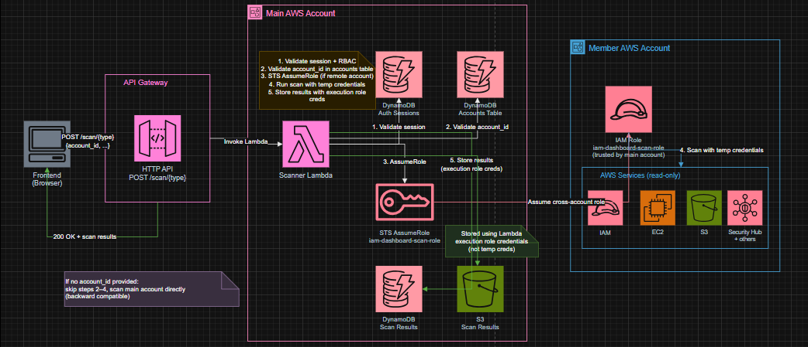

# Multi-Account Lite — Production Design

## Problem Statement

The scanner Lambda currently scans only the AWS account it resides in. This document covers the production/cloud design for extending the IAM Dashboard to support scanning multiple AWS accounts, allowing users to register accounts, switch between them, and trigger scans against any registered account.

This document covers the cloud/Lambda architecture. For the local Flask backend design, see [`Multi-Account-Support-via-AWS-Organizations.md`](../backend/Multi-Account-Support-via-AWS-Organizations.md).

---

## Design Decisions

- **Manual account registration** — accounts are explicitly registered by an admin via API, stored in DynamoDB. No AWS Organizations dependency.
- **Fixed cross-account role name** — all member accounts must have a role named `iam-dashboard-scan-role` with the required trust and permissions policies.
- **One account scanned at a time** — the scanner Lambda receives an `account_id` parameter and scans that account only.
- **Role assumption handled by the scanner Lambda** — the Lambda assumes the cross-account role using STS, uses those credentials only for scanning, and uses its own execution role credentials for storing results.
- **Backward compatible** — if no `account_id` is provided on a scan request, the Lambda scans its own (main) account as before.
- **Session-cookie auth on all routes** — the account management Lambda validates the `iamdash_session` cookie on every request, same pattern as the scanner Lambda.

---

## Architecture

### Components

| Component | Description |
|---|---|
| **DynamoDB accounts table** (`iam-dashboard-accounts`) | Stores registered account metadata |
| **Account management Lambda** | Handles account registration, listing, and deletion |
| **Scanner Lambda** (existing, modified) | Gains `account_id` parameter support and STS role assumption |
| **API Gateway** (existing iam-dashboard-api module) | 3 new routes added for account management |
| **Cross-account IAM role** (`iam-dashboard-scan-role`) | Exists in each member account; assumed by the scanner Lambda |
| **Scanner Lambda execution role** (existing, modified) | Gains `sts:AssumeRole` and `dynamodb:GetItem` on accounts table |

### Request Flow: Scanning a Registered Account

1. Frontend sends `POST /scan/{type}` with `account_id` in the request body
2. API Gateway invokes the scanner Lambda
3. Lambda validates the `iamdash_session` cookie and enforces RBAC (existing behavior)
4. Lambda looks up `account_id` in the accounts DynamoDB table to confirm it is registered
5. If `account_id` is not the main account, Lambda calls `sts:AssumeRole` on `arn:aws:iam::{account_id}:role/iam-dashboard-scan-role`
6. Lambda uses the temporary credentials to run the scan against the remote account
7. Lambda uses its own execution role credentials to store results in DynamoDB and S3 (main account)
8. Results are returned to the frontend

### Request Flow: Account Registration

1. Frontend sends `POST /accounts` with `account_id` and `account_name`
2. API Gateway invokes the account management Lambda
3. Lambda validates the `iamdash_session` cookie and extracts `username`
4. Lambda attempts `sts:AssumeRole` on the specified account to verify the role exists and is assumable
5. On success, Lambda writes the account record to DynamoDB
6. Success response returned to frontend

---

## DynamoDB Accounts Table

**Table name:** `iam-dashboard-accounts`

| Attribute | Type | Description |
|---|---|---|
| `account_id` | String (PK) | 12-digit AWS account ID |
| `account_name` | String | Human-readable display name |
| `date_added` | String | UTC ISO 8601 timestamp (e.g. `2026-04-06T14:00:00Z`) |
| `added_by` | String | Username extracted from the session cookie at registration time |

No sort key. Partition key is `account_id`.

---

## API Routes

Three new routes added to the existing combined API Gateway module (`infra/APIGateway_Auth_and_Scanner`).

### `POST /accounts`

Register a new AWS account.

**Request body:**
```json
{
  "account_id": "123456789012",
  "account_name": "Production"
}
```

**Logic:**
1. Validate `iamdash_session` cookie — return `401` if missing/expired
2. Extract `username` from session
3. Attempt `sts:AssumeRole` on `arn:aws:iam::{account_id}:role/iam-dashboard-scan-role` — return `403` if role cannot be assumed
4. Write record to DynamoDB accounts table
5. Return `201` on success

**Responses:**

| Status | Body |
|---|---|
| `201` | `{"message": "Account registered successfully"}` |
| `400` | `{"error": "account_id and account_name are required"}` |
| `401` | `{"error": "Authentication required"}` |
| `403` | `{"error": "Cannot assume role in account {account_id} — verify iam-dashboard-scan-role exists and trusts this account"}` |
| `409` | `{"error": "Account {account_id} is already registered"}` |
| `500` | `{"error": "Failed to register account"}` |

### Architecture 


---

### `DELETE /accounts/{account_id}`

Remove a registered account.

**Logic:**
1. Validate `iamdash_session` cookie — return `401` if missing/expired
2. Extract `username` from session
3. `GetItem` from DynamoDB to confirm account exists — return `404` if not found
4. `DeleteItem` from DynamoDB
5. Log to CloudWatch: `User {username} deleted account {account_name} ({account_id}) at {timestamp}`
6. Return `200` on success

**Responses:**

| Status | Body |
|---|---|
| `200` | `{"message": "Account removed successfully"}` |
| `401` | `{"error": "Authentication required"}` |
| `404` | `{"error": "Account {account_id} not found"}` |
| `500` | `{"error": "Failed to remove account"}` |

### Architecture


---

### `GET /accounts`

List all registered accounts.

**Logic:**
1. Validate `iamdash_session` cookie — return `401` if missing/expired
2. `Scan` the DynamoDB accounts table
3. If table is empty or does not exist, fall back to returning the Lambda's own account (via `sts:GetCallerIdentity`) with name `"Main Account"`
4. Return account list with total count

**Response:**
```json
{
  "accounts": [
    {"account_id": "123456789012", "account_name": "Production"},
    {"account_id": "987654321098", "account_name": "Dev Sandbox"}
  ],
  "total": 2
}
```

**Responses:**

| Status | Body |
|---|---|
| `200` | Account list as above |
| `401` | `{"error": "Authentication required"}` |
| `500` | `{"error": "Failed to retrieve accounts"}` |

### Architecture 


---

## IAM Roles and Policies

### 1. Cross-Account Role (`iam-dashboard-scan-role`)

This role must be created manually in each member account before that account can be registered.

**Trust policy** — allows the scanner Lambda's execution role in the main account to assume it:

```json
{
  "Version": "2012-10-17",
  "Statement": [
    {
      "Effect": "Allow",
      "Principal": {
        "AWS": "arn:aws:iam::MAIN_ACCOUNT_ID:role/iam-dashboard-lambda-role"
      },
      "Action": "sts:AssumeRole"
    }
  ]
}
```

Replace `MAIN_ACCOUNT_ID` with the AWS account ID where the scanner Lambda lives.

**Permissions policy** — read-only scanning permissions only. No storage permissions (results are stored in the main account using the Lambda's own credentials):

```json
{
  "Version": "2012-10-17",
  "Statement": [
    {
      "Effect": "Allow",
      "Action": [
        "s3:ListBucket",
        "s3:ListAllMyBuckets",
        "s3:GetBucketEncryption",
        "s3:GetPublicAccessBlock",
        "s3:GetBucketVersioning"
      ],
      "Resource": "*"
    },
    {
      "Effect": "Allow",
      "Action": [
        "dynamodb:PutItem",
        "dynamodb:GetItem",
        "dynamodb:UpdateItem",
        "dynamodb:Query",
        "dynamodb:Scan"
      ],
      "Resource": "*"
    },
    {
      "Effect": "Allow",
      "Action": [
        "securityhub:GetFindings",
        "securityhub:BatchImportFindings",
        "securityhub:GetInsights",
        "securityhub:GetComplianceSummary"
      ],
      "Resource": "*"
    },
    {
      "Effect": "Allow",
      "Action": [
        "guardduty:ListDetectors",
        "guardduty:GetDetector",
        "guardduty:ListFindings",
        "guardduty:GetFindings",
        "guardduty:DescribeFindings"
      ],
      "Resource": "*"
    },
    {
      "Effect": "Allow",
      "Action": [
        "config:DescribeConfigRules",
        "config:GetComplianceSummaryByConfigRule",
        "config:GetComplianceSummaryByResourceType",
        "config:DescribeComplianceByConfigRule",
        "config:DescribeComplianceByResource"
      ],
      "Resource": "*"
    },
    {
      "Effect": "Allow",
      "Action": [
        "inspector2:ListFindings",
        "inspector2:GetFindings",
        "inspector2:BatchGetFindings",
        "inspector2:ListScans"
      ],
      "Resource": "*"
    },
    {
      "Effect": "Allow",
      "Action": [
        "macie2:ListFindings",
        "macie2:GetFindings",
        "macie2:BatchGetFindings",
        "macie2:DescribeBuckets"
      ],
      "Resource": "*"
    },
    {
      "Effect": "Allow",
      "Action": [
        "iam:ListUsers",
        "iam:GetUser",
        "iam:ListRoles",
        "iam:GetRole",
        "iam:ListAttachedUserPolicies",
        "iam:ListAttachedRolePolicies",
        "iam:ListRolePolicies",
        "iam:GetRolePolicy",
        "iam:GetUserPolicy",
        "iam:ListUserPolicies",
        "iam:GetPolicy",
        "iam:GetPolicyVersion",
        "iam:ListPolicyVersions",
        "iam:ListMFADevices",
        "iam:ListAccessKeys",
        "iam:GetAccessKeyLastUsed",
        "iam:ListPolicies",
        "iam:ListGroups",
        "iam:GetCallerIdentity"
      ],
      "Resource": "*"
    },
    {
      "Effect": "Allow",
      "Action": [
        "ec2:DescribeInstances",
        "ec2:DescribeSecurityGroups",
        "ec2:DescribeVolumes",
        "ec2:DescribeSnapshots",
        "ec2:DescribeImages"
      ],
      "Resource": "*"
    }
  ]
}
```

### 2. Scanner Lambda Execution Role (`iam-dashboard-lambda-role`) — additions

Two new statements added to the existing `lambda-role-policy.json`:

```json
{
  "Effect": "Allow",
  "Action": "sts:AssumeRole",
  "Resource": "arn:aws:iam::*:role/iam-dashboard-scan-role"
},
{
  "Effect": "Allow",
  "Action": ["dynamodb:GetItem", "dynamodb:Scan"],
  "Resource": "arn:aws:dynamodb:*:*:table/iam-dashboard-accounts"
}
```

### 3. Account Management Lambda Execution Role

New role for the account management Lambda. Needs:

- `logs:CreateLogGroup`, `logs:CreateLogStream`, `logs:PutLogEvents` — CloudWatch logging
- `dynamodb:PutItem`, `dynamodb:GetItem`, `dynamodb:DeleteItem`, `dynamodb:Scan` — accounts table only
- `sts:AssumeRole` on `arn:aws:iam::*:role/iam-dashboard-scan-role` — to verify role exists at registration time
- `sts:GetCallerIdentity` — for the `GET /accounts` fallback

---

## Scanner Lambda Changes

### New `account_id` parameter

The existing scan endpoints (`POST /scan/{type}`) gain an optional `account_id` in the request body. If omitted, behavior is unchanged (scans the main account).

### Cross-account credential handling

When `account_id` is provided and differs from the main account:

1. Validate `account_id` exists in the accounts DynamoDB table
2. Call `sts:AssumeRole` with session name `DashboardScan-{account_id}`
3. Use the returned temporary credentials to construct boto3 clients for scanning
4. Use the Lambda's own execution role credentials for all DynamoDB/S3 storage calls

The Lambda holds both credential sets simultaneously — no switching needed.

### Result scoping

Scan results stored in DynamoDB and S3 should include `account_id` and `account_name` so results from different accounts are distinguishable. The `account_id` field already exists in the DynamoDB scan results table schema.

### Architecture


---

## Account Management Lambda

New Lambda function, separate from the scanner Lambda. Handles only account registration, listing, and deletion. Has no scanning permissions.

**File:** `infra/lambda-accounts/lambda_function.py` (new)

Shares the same session validation pattern as the scanner Lambda:
- `parse_request_cookies(event)`
- `get_session(session_id)`
- `require_authenticated_session(event)`
- Custom exception classes: `UnauthorizedError`, `ForbiddenError`, `SessionStoreError`

---

## Prerequisites

Before an account can be registered:

1. The `iam-dashboard-scan-role` IAM role must exist in the member account with the trust policy and permissions policy defined above.
2. The scanner Lambda's execution role ARN (`arn:aws:iam::MAIN_ACCOUNT_ID:role/iam-dashboard-lambda-role`) must be substituted into the trust policy.
3. The `iam-dashboard-accounts` DynamoDB table must exist in the main account.

---

## What Is Not Changing

- Scanner Lambda scan logic — existing scan functions are unchanged; they just receive boto3 clients constructed with different credentials
- Auth Lambda and auth flow
- Existing API Gateway routes
- DynamoDB scan results table schema (`account_id` field already exists)
- RBAC enforcement — existing group-to-scanner-type mapping is unchanged
- Terraform infrastructure for existing modules

---

## Future Extensibility

- Per-account role ARN support (replace fixed role name with a stored ARN per account)
- Account status tracking (`last_scanned`, `scan_status`)
- AWS Organizations integration for auto-discovery
- Finer-grained RBAC per account (restrict which groups can scan which accounts)
