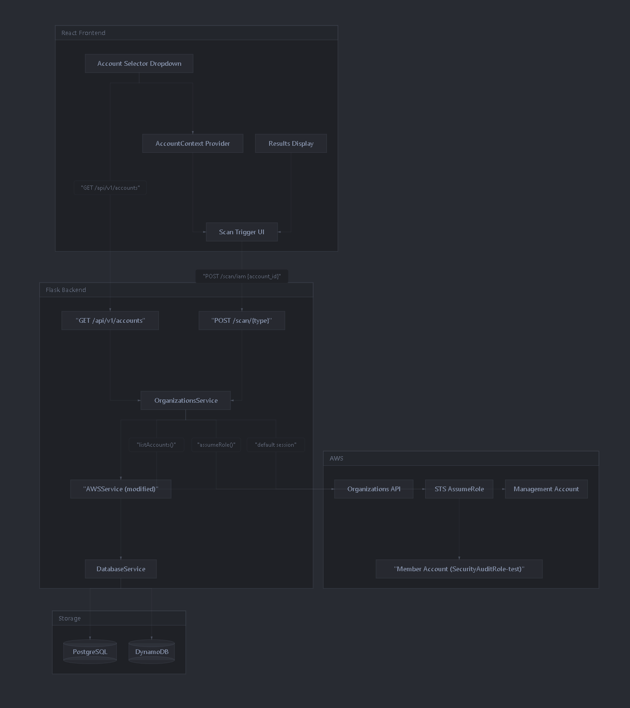
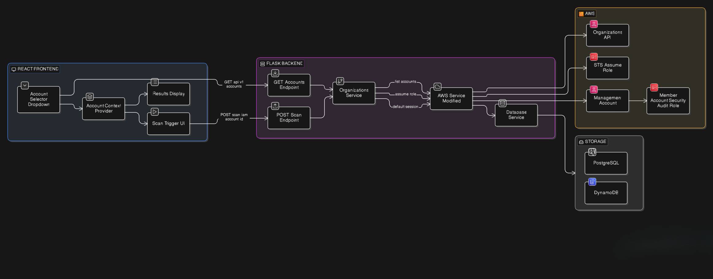
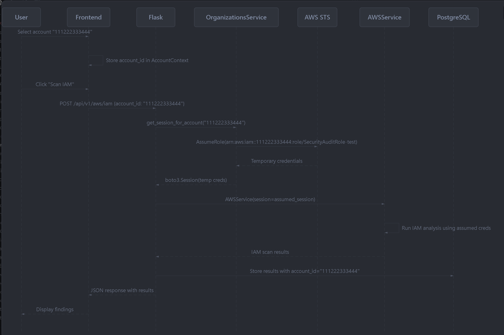
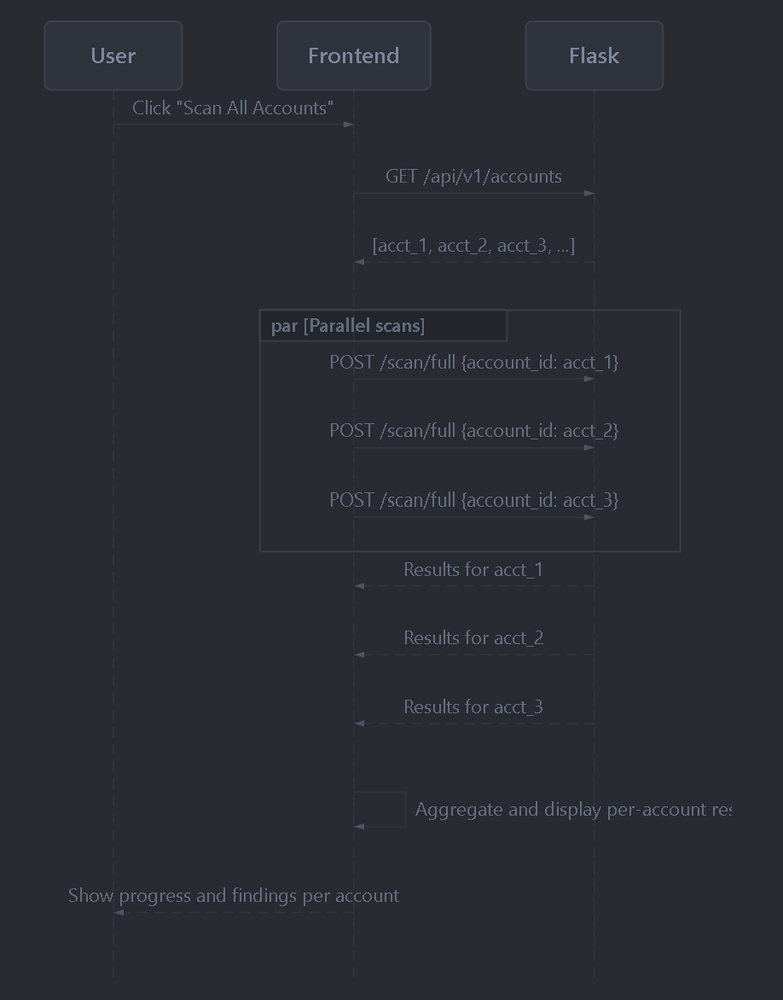

# **Multi-Account Support via AWS Organizations Dev Plan**

## **Problem Statement**

The dashboard currently scans a single AWS account (whichever credentials are in `.env`). We need users to be able to list all accounts under an AWS Organization, switch between them, and scan any account individually or all accounts at once.

## **Design Decisions**

- **No new database table** for accounts - list is fetched live from the Organizations API  
- **No Redis for session state** - the frontend holds the selected account in React state and passes `account_id` with every API request (stateless)  
- **No new scan endpoints** - existing `/scan/{type}` endpoints gain an optional `account_id` parameter  
- **"Scan All" is frontend-driven** - the frontend loops over accounts and fires parallel scan calls (no backend orchestrator)  
- **Default behavior when no `account_id` is provided** - falls back to scanning the management account (backward compatible)  
- **Management account appears in the account list** alongside member accounts  
- **Lambda function is out of scope** for this phase - changes target the Flask backend only

---

## **Architecture Overview**

Same as above

## **Request Flow: Scanning a Specific Account**

## **Request Flow: "Scan All Accounts"**

## **Backend Changes**

### **1 New file: `backend/services/organizations_service.py`**

A single service class with two responsibilities:

- `**list_accounts()**` - Calls `organizations:ListAccounts` using management account creds from env. Returns all active accounts (including the management account). Paginates automatically. Raises an explicit error (not an empty list) if the API call fails.  
- `**get_session_for_account(account_id)**` - If `account_id` matches `AWS_MANAGEMENT_ACCOUNT_ID`, returns the default `boto3.Session()` (no role assumption needed). Otherwise, calls `sts:AssumeRole` on `arn:aws:iam::{account_id}:role/{CROSS_ACCOUNT_ROLE_NAME}` and returns a new `boto3.Session` with the temporary credentials. Session name: `DashboardScan-{account_id}`.

### **2 New file: `backend/api/accounts.py`**

A single Flask-RESTful `Resource`:

- `**GET /api/v1/accounts**` - Calls `OrganizationsService.list_accounts()`, returns JSON array of `{id, name, email, is_management}`. If the Organizations API call fails, returns HTTP 502 with a clear error message.

### **3 Modify: backend/services/awsservice.py**

The constructor currently hardcodes `self.session = boto3.Session()`. Change it to accept an optional session parameter:

def init(self, session: boto3.Session  None):  
    self.session  session or boto3.Session()  
    self.regions  'us-east-1', 'us-west-2', 'eu-west-1', 'ap-southeast-1'

This is the only change to this file. All downstream `get_client()` calls automatically use whichever session was injected.

### **4 Modify: backend/api/awsiam.py (and all other API resources)**

Each resource currently does `self.aws_service = AWSService()` in `__init_`. The pattern changes to:

- Parse `account_id` from the request (query param for GET, body for POST)  
- If `account_id` is provided, call `OrganizationsService.get_session_for_account(account_id)` to get an assumed-role session  
- Pass that session to `AWSService(session=assumed_session)`  
- If no `account_id`, use the default session (management account) for backward compatibility  
- Include `account_id` and `account_name` when storing results

Files to touch: awsiam.py, awsec2.py, awss3.py, awssecurityhub.py, awsconfig.py, dashboard.py

### **5 Modify: backend/app.py**

- Import and register the new `AccountsResource` at `/accounts`  
- Add `AWS_MANAGEMENT_ACCOUNT_ID` and `CROSS_ACCOUNT_ROLE_NAME` to app config from env  
- Instantiate `OrganizationsService` alongside existing services

### **6 Modify: docker-compose.yml**

Add two new env vars to the `app` service:

## - AWSMANAGEMENTACCOUNTID=${AWSMANAGEMENTACCOUNTID}

## - CROSSACCOUNTROLENAME=${CROSSACCOUNTROLENAME:-SecurityAuditRole-test}  

## **Frontend Changes**

### **7 New file: `src/context/AccountContext.tsx`**

A React context provider that:

- On mount, fetches `GET /api/v1/accounts` and stores the list  
- Exposes `accounts`, `selectedAccount`, `setSelectedAccount`, and `isLoading`  
- Defaults `selectedAccount` to the management account (the one with `is_management: true`)  
- In mock mode, returns a fixture list of fake accounts

### **8 New file: `src/components/AccountSelector.tsx`**

A dropdown component (using existing Radix UI `DropdownMenu` primitives from `src/components/ui/`) that:

- Shows the currently selected account name and ID  
- Lists all org accounts from `AccountContext`  
- Includes an "All Accounts" option at the top  
- Highlights the management account with a subtle badge  
- Lives in the Header bar, next to the existing search/notification area

### **9 Modify: src/services/api.ts**

- Add `account_id?: string` to the `ScanRequest` interface  
- Add a new `fetchAccounts()` function that calls `GET /api/v1/accounts`  
- All existing scan functions (`scanIAM`, `scanEC2`, etc.) gain an optional `accountId` parameter that gets included in the request body  
- Add `account_id` and `account_name` to the `ScanResponse` interface

### **10 Modify: src/context/ScanResultsContext.tsx**

The current storage key in `sessionStorage` is flat: `Map<scannerType, StoredScanResult>`. This needs to become account-aware:

- Change the map key to `{accountId}:{scannerType}` (e.g., `111222333444:iam`)  
- Add `account_id` and `account_name` fields to `StoredScanResult`  
- `getScanResult(scannerType)` should filter by the currently selected account  
- `getAllScanResults()` can accept an optional account filter

### **11 Modify: src/pages/DashboardApp.tsx**

- Wrap the app tree with `AccountProvider` (alongside existing `ScanResultsProvider`)  
- Pass account context down to scan-triggering components

### **12 Modify: src/components/Header.tsx**

- Add the `AccountSelector` component to the header bar

### **13 Modify: src/mock/apiMock.ts**

- Add a mock response for `GET /api/v1/accounts` so mock mode continues to work

---

## **Environment Variables**

Added to `.env` (and documented):

AWSMANAGEMENTACCOUNTID=123456789012  
CROSSACCOUNTROLENAME=SecurityAuditRole-test

No changes to existing variables. `AWS_ACCESS_KEY_ID` and `AWS_SECRET_ACCESS_KEY` continue to hold the management account credentials.

---

## **Error Handling**

| Scenario                                   | Behavior                                                                                                                                            |
| ------------------------------------------ | --------------------------------------------------------------------------------------------------------------------------------------------------- |
| `organizations:ListAccounts` fails         | Return HTTP 502 with error message - never silently return empty list                                                                               |
| `sts:AssumeRole` fails for one account     | Return HTTP 403 with clear message ("Cannot assume role in account X - check that SecurityAuditRole-test exists and trusts the management account") |
| `account_id` not provided on scan request  | Default to management account (backward compatible)                                                                                                 |
| `account_id` provided but not found in org | Return HTTP 404                                                                                                                                     |

---

## **What is NOT Changing**

- Lambda function (`infra/lambda/lambda_function.py`) - out of scope for this phase  
- DynamoDB table schema - `account_id` is already a field  
- PostgreSQL schema - `account_id` columns already exist on all models  
- Existing scan logic in `AWSService` methods - they just receive a session  
- GitHub Actions CI/CD pipeline  
- Terraform infrastructure (cross-account IAM roles are managed separately)  
- Grafana/Prometheus monitoring setup

---

## **Coordination Note: Cognito**

Cognito authentication is being implemented (B10 JWT validation). These two features are independent and can proceed in parallel. The only integration point: once Cognito lands, the new `GET /api/v1/accounts` endpoint should be placed behind the same JWT auth middleware as all other protected routes. No blocking dependency.

---

## **Prerequisites (before implementation)**

1. The `SecurityAuditRole-test` IAM role must exist in each member account with:
  - A trust policy allowing the management account to assume it  
  - An inline policy granting read-only permissions: `iam:Get`*, `iam:List`*, `ec2:Describe*`, `s3:List*`, `s3:GetBucketPolicy`, `securityhub:Describe*`, `guardduty:List*`, `inspector2:List*`, `macie2:List*`
2. The management account credentials in `.env` must have `organizations:ListAccounts` and `sts:AssumeRole` permissions
3. AWS Organizations must be enabled with member accounts in ACTIVE status

