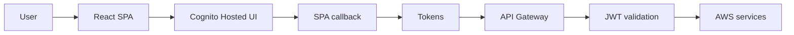

# Backend Cognito & Auth Infrastructure

## Summary

This document describes how the **backend** integrates with **Amazon Cognito** and the rest of the IAM Dashboard stack. It is the backend-facing companion to `infra/cognito/COGNITO_CONFIG.md` (which focuses on Terraform).

At a high level we use:

- **Cognito User Pool + Hosted UI** for sign-in
- **React SPA (Vite)** as the OAuth client
- **CloudFront + S3** to serve the SPA in production
- **API Gateway + Lambda** (and/or Flask locally) as the backend API
- **JWT validation** (B10) planned on the backend using Cognito-issued tokens

---

## Components and responsibilities

- **Cognito User Pool**
  - Users sign in with **email** as the username attribute.
  - Enforces a strong password policy.
  - Issues **ID**, **Access**, and **Refresh** tokens.

- **Cognito App Client (`iam-dashboard-client`)**
  - OAuth flow: **Authorization Code** (`code`) with PKCE via `react-oidc-context`.
  - Scopes: `openid`, `email`, `profile`.
  - Callback / logout URLs:
    - Local Vite: `http://localhost:5173/`
    - Local Docker: `http://localhost:3001/`
    - Production: `https://d33ytnxd7i6mo9.cloudfront.net/`

- **Hosted UI Domain**
  - Domain: `https://us-east-1h7e0irb5v.auth.us-east-1.amazoncognito.com`
  - Provides the login page and logout endpoint.

- **Frontend SPA**
  - Dev: Vite on `http://localhost:5173/` (`npm run dev`).
  - Docker dev: `http://localhost:3001/` via `docker-compose`.
  - Prod: CloudFront distribution in front of S3.
  - Uses `react-oidc-context` + `oidc-client-ts` for all OAuth logic.

- **Backend API**
  - Dev: Flask app at `http://localhost:5001` (via Docker).
  - Prod: API Gateway + Lambda (`iam-dashboard-scanner`).
  - Will validate **Cognito JWTs** (B10) before serving protected endpoints.

---

## Environment variables (frontend)

The SPA is configured via Vite env vars (see `.env` and `src/env.example`):

```bash
VITE_API_GATEWAY_URL=https://erh3a09d7l.execute-api.us-east-1.amazonaws.com/v1

VITE_COGNITO_AUTHORITY=https://cognito-idp.us-east-1.amazonaws.com/us-east-1_H7e0Irb5V
VITE_COGNITO_CLIENT_ID=3593qhqul52rgr79mi033f9v1l

# Dev redirect (Vite)
VITE_COGNITO_REDIRECT_URI=http://localhost:5173/

# Hosted UI domain and logout redirect
VITE_COGNITO_DOMAIN=https://us-east-1h7e0irb5v.auth.us-east-1.amazoncognito.com
VITE_COGNITO_LOGOUT_URI=http://localhost:5173/
```

In production set:

```bash
VITE_COGNITO_REDIRECT_URI=https://d33ytnxd7i6mo9.cloudfront.net/
VITE_COGNITO_LOGOUT_URI=https://d33ytnxd7i6mo9.cloudfront.net/
```

These must match the **Allowed callback URLs** and **Allowed sign-out URLs** in the Cognito app client, or Cognito returns `redirect_mismatch`.

---

## High-level architecture



---

## Login and token flow (detailed)

1. **User opens the dashboard**
   - Dev: `http://localhost:5173/`
   - Prod: `https://d33ytnxd7i6mo9.cloudfront.net/`

2. **SPA initializes OIDC client**
   - `AuthProvider` from `react-oidc-context` is configured with:
     - `authority = VITE_COGNITO_AUTHORITY`
     - `client_id = VITE_COGNITO_CLIENT_ID`
     - `redirect_uri = VITE_COGNITO_REDIRECT_URI`
     - `scope = "openid email profile"`

3. **User clicks "Sign in"**
   - SPA calls `auth.signinRedirect()`.
   - Browser is redirected to `https://us-east-1h7e0irb5v.auth.us-east-1.amazoncognito.com/login?...`.

4. **Cognito Hosted UI handles authentication**
   - User enters credentials.
   - Cognito validates user against the User Pool.
   - On success, Cognito redirects back to `redirect_uri` with `?code=...&state=...`.

5. **SPA callback and token exchange**
   - The SPA at `redirect_uri` bootstraps `react-oidc-context`.
   - The library verifies `state`, exchanges the `code` for tokens (ID, Access, Refresh) against Cognito, and stores them.
   - `useAuth()` in `App.tsx` sees `auth.isAuthenticated = true` and renders the full dashboard.

6. **Authenticated API calls**
   - SPA sends `Authorization: Bearer <access_token>` in requests (e.g. via `src/services/api.ts`) to API Gateway (prod) or Flask (dev).

7. **Backend JWT validation (B10)**
   - Backend uses Cognito JWKS (`https://cognito-idp.us-east-1.amazonaws.com/us-east-1_H7e0Irb5V/.well-known/jwks.json`) to validate signature, `iss`, `aud`/`client_id`, `exp`.
   - If valid → process request; if invalid → `401 Unauthorized`.

8. **Sign out**
   - SPA calls logout handler: `auth.removeUser()` then redirects to Cognito logout URL with `client_id` and `logout_uri`. Cognito redirects back to `VITE_COGNITO_LOGOUT_URI`.

---

## Backend responsibilities (B1, B6, B7, B10)

- **B6 – Add Cognito User Pool via Terraform**
  - `infra/cognito/` creates User Pool, App Client, and Domain; `terraform.tfvars` controls pool name, domain prefix, callback and logout URLs.

- **B1 – Document AWS infra for OAuth + Cognito**
  - This file plus `infra/cognito/COGNITO_CONFIG.md` document resources, env vars, and how SPA and backend use them.

- **B7 – Implement OAuth login flow (Hosted UI)**
  - SPA uses `react-oidc-context` and Cognito Hosted UI; no custom backend `/auth/login` route for the MVP.

- **B10 – Secure APIs with JWT validation**
  - Backend will validate Access Tokens using Cognito JWKS on protected routes. Flask middleware from `backend/auth/JWT Validator.md` can be adapted to use Cognito instead of `DEV_BEARER_TOKEN`.

---

## Future enhancements

- Manage all Cognito settings in Terraform as the single source of truth.
- Add backend session introspection/revocation for high-risk operations.
- Add claims-based authorization (RBAC) on top of validated tokens.
