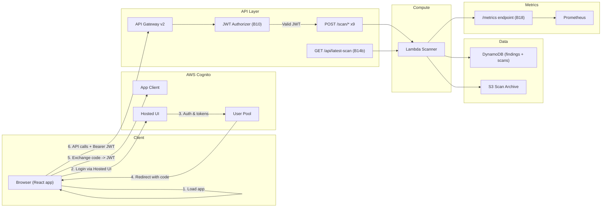

# Backend Auth & Data Milestones (B10, B13, B14b, B18)

This plan explains, in beginner-friendly language, how to deliver four key backend milestones:

- **B10 – Secure APIs with JWT validation**
- **B13 – Unified findings schema**
- **B14b – API: latest scan results (refresh-safe)**
- **B18 – Metrics endpoint for Prometheus**

For each one we cover:
- **What it is**
- **Why it matters**
- **How it connects to the rest of the system**
- **Concrete steps to build it**
- **What “done” looks like**

We also add simple diagrams so the whole team can see how pieces fit together.

---

## 1. Big Picture Diagram

This shows how the browser, Cognito, API Gateway, Lambda, DynamoDB, and metrics fit together once these milestones are done.



- **B10** (JWT validation) sits in **`jwtAuth` + API Gateway config**.
- **B13** (unified schema) is about **how data is stored in `dynamodb` and returned from Lambda**.
- **B14b** adds **`GET /api/latest-scan`** which reads from DynamoDB using the unified schema.
- **B18** adds **`/metrics`** so Prometheus can scrape data from the backend.

---

## 2. B10 – Secure APIs with JWT Validation

### 2.1 What it is

- Today, the API routes (for example `POST /scan/security-hub`) do **not** check if the caller is logged in.
- **JWT validation** means:
  - The browser sends an **access token** (a JWT) in the `Authorization: Bearer <token>` header.
  - **API Gateway** checks the JWT before it forwards the request to Lambda.
  - If the token is missing or invalid, the request is blocked with `401`/`403`.

### 2.2 Why it matters

- Without JWT validation, anyone who knows the API URL can trigger scans or read data.
- With JWT validation:
  - Only logged-in users can hit the API.
  - The backend gets a trusted `user_id` and other claims from the token.

### 2.3 Where it lives in the code

- Terraform: `[infra/api-gateway/main.tf]` and `[infra/api-gateway/variables.tf]`
- Cognito: `[infra/cognito/*]` and the user pool/app client that already exist.
- Frontend: `Authorization: Bearer <access_token>` is already supported by the Cognito React setup.

### 2.4 Steps to implement (API Gateway authorizer)

1. **Confirm Cognito info**
   - Get the **User Pool ID** and region.
   - Compute the **issuer URL**: `https://cognito-idp.<region>.amazonaws.com/<user_pool_id>`.
   - Note the **app client ID** (audience).

2. **Add JWT authorizer in Terraform**
   - In `[infra/api-gateway/main.tf]`, define `aws_apigatewayv2_authorizer` with:
     - `authorizer_type = "JWT"`
     - `identity_sources = ["$request.header.Authorization"]`
     - `jwt_configuration` using the Cognito **issuer** and **audience**.

3. **Wire the authorizer into routes**
   - For each `aws_apigatewayv2_route` in `[infra/api-gateway/main.tf]`:
     - Set `authorization_type = "JWT"`.
     - Set `authorizer_id = aws_apigatewayv2_authorizer.<name>.id`.

4. **Apply and test**
   - Run `terraform plan` and `terraform apply` from `infra/`.
   - From the browser app:
     - When logged out: API calls should fail with `401/403`.
     - When logged in: API calls should succeed.

5. **Optional backend checks**
   - In Lambda, read claims from the event (for logging or future RBAC), but trust API Gateway for signature and expiry.

### 2.5 What “done” looks like (B10)

- All scan routes (`POST /scan/*`) and any other protected APIs:
  - **Reject** requests without a valid Cognito JWT.
  - **Accept** requests with a valid JWT from our Cognito user pool.
- There is a short **DEV note** or README section explaining how to get a token and test with curl/Postman.
- Frontend can safely assume: “If the call returns 200, the user is authenticated.”

### 2.6 Rough time estimate (single student, using AI)

- **Total:** about **1 working day** (≈ **4–6 hours** of focused time).
- **Breakdown:**
  - 1–2 hours: read existing Terraform and Cognito config, understand how API Gateway is wired.
  - 1–2 hours: add the `aws_apigatewayv2_authorizer` resource and update all routes.
  - 1–2 hours: run `terraform plan/apply` and test from the frontend and with curl/Postman.

Assumes the student leans on AI to help write the Terraform resource and test commands, and asks for review from a teammate before merging.

---

## 3. B13 – Unified Findings Schema

### 3.1 What it is

- Right now, different scans may store results in slightly different shapes (field names, nesting, etc.).
- **Unified findings schema** means:
  - Every finding we store has the **same basic structure**, no matter which scanner produced it.
  - Example fields:
    - `finding_id`
    - `scan_id`
    - `account_id`
    - `service` (IAM, S3, EC2, etc.)
    - `severity`
    - `title`
    - `description`
    - `remediation`
    - `timestamp`

### 3.2 Why it matters

- Frontend, AI, and reporting can all depend on **one shape** instead of special cases.
- Makes it much easier to:
  - Show lists of findings.
  - Build graphs and metrics.
  - Write tests.

### 3.3 Where it lives in the code

- Lambda: `[infra/lambda/lambda_function.py]` and related services.
- DynamoDB tables: `[infra/dynamodb/*]` and `DYNAMODB_SETUP.md`.

### 3.4 Steps to implement

1. **Design the schema (on paper or in a doc)**
   - Start with the fields listed above.
   - Mark which fields are **required** and which are **optional**.
   - Create a short markdown spec in `docs/backend/findings-schema.md` (or similar).

2. **Update the Lambda code to use the schema**
   - In `lambda_function.py`, find where findings are built before writing to DynamoDB.
   - Create a helper function, for example `build_finding(...)`, that returns a Python dict matching the unified schema.
   - Make each scanner-specific block call this helper instead of building ad-hoc dicts.

3. **Update DynamoDB writes**
   - Ensure the table structure matches the schema (partition key, sort key).
   - Double-check that all required fields are present before writing.

4. **Add a simple validation step (optional but helpful)**
   - Before writing to DynamoDB, run a quick check that required keys exist.
   - Log a clear error if something is missing.

5. **Test with a sample scan**
   - Run the scanner once.
   - Look at a stored item in DynamoDB (via AWS Console or CLI) and confirm it matches the schema doc.

### 3.5 What “done” looks like (B13)

- There is a **single, documented schema** for findings.
- All new findings written by Lambda follow this schema.
- At least one real scan has been run and the stored results match the schema.
- Frontend/AI/docs can link to this schema as the single source of truth.

### 3.6 Rough time estimate (single student, using AI)

- **Total:** about **1–1.5 working days** (≈ **6–10 hours** of focused time).
- **Breakdown:**
  - 2–3 hours: design the schema and write the short markdown spec.
  - 2–3 hours: refactor `lambda_function.py` to use a `build_finding(...)` helper and update DynamoDB writes.
  - 2–4 hours: run sample scans, inspect DynamoDB items, and fix any shape mismatches.

AI can help draft the schema and the helper function, but the student still needs to trace through where findings are created and verify real data matches the spec.

---

## 4. B14b – API: Latest Scan Results (Refresh-Safe)

### 4.1 What it is

- **Problem today:** If the page reloads, the UI may lose state and not know what the “current” scan is.
- **B14b adds an API** like:
  - `GET /api/latest-scan` or `GET /api/scans/latest`
  - It returns the **most recent scan** and its findings for the current account.

### 4.2 Why it matters

- Frontend can:
  - On page load, call `GET /api/latest-scan`.
  - Show the most recent results without asking the user to click “scan” again.
- Makes the dashboard **refresh-safe** and more reliable.

### 4.3 Where it lives in the code

- Lambda/API code: same codebase as the scanners, probably new handler function.
- API Gateway routing: `[infra/api-gateway/main.tf]` if you expose it via HTTP API.
- DynamoDB data: uses the unified schema from B13.

### 4.4 Steps to implement

1. **Decide the endpoint shape**
   - For example:
     - `GET /api/latest-scan`
     - Response:
       ```json
       {
         "scan_id": "...",
         "account_id": "...",
         "started_at": "...",
         "status": "completed",
         "findings": [ /* unified findings from B13 */ ]
       }
       ```

2. **Add a Lambda handler for latest scan**
   - In `lambda_function.py` (or a separate module), create a function that:
     - Reads from a **scans table** or uses a sort key to find the latest scan for the account.
     - Queries DynamoDB for findings tied to that `scan_id`.
     - Returns the JSON payload in the shape above.

3. **Wire the route in API Gateway**
   - In Terraform, add a route for `GET /api/latest-scan` pointing to the Lambda integration.
   - Reuse the **JWT authorizer** from B10 so this endpoint is also protected.

4. **Frontend integration (lightweight for now)**
   - On app load, call `GET /api/latest-scan`.
   - If there is a latest scan, show it; if not, show an empty state.

### 4.5 What “done” looks like (B14b)

- `GET /api/latest-scan` (or similar) exists in staging/prod.
- When the app reloads, it calls this endpoint and shows the latest data.
- If no scans exist yet, the endpoint returns a clear empty response (e.g. `404` with a simple JSON body or `200` with `{ "has_scan": false }`).

### 4.6 Rough time estimate (single student, using AI)

- **Total:** about **1 working day** (≈ **4–8 hours** of focused time).
- **Breakdown:**
  - 1–2 hours: design the exact response shape and write it down.
  - 2–3 hours: add the Lambda handler to query DynamoDB for the latest scan and its findings.
  - 1–3 hours: wire the new route in API Gateway and add a basic frontend call to exercise it.

AI can help with DynamoDB query patterns and sample handler code. The student’s main work is choosing keys, making sure the query returns the right “latest” scan, and testing edge cases (no scans yet).

---

## 5. B18 – Metrics Endpoint for Prometheus

### 5.1 What it is

- **Metrics endpoint** is a simple HTTP endpoint (usually `/metrics`) that exposes:
  - Total number of scans
  - Number of failed scans
  - Maybe number of findings by severity
- **Prometheus** scrapes this endpoint regularly and stores the numbers.

### 5.2 Why it matters

- Grafana dashboards (data team) need **numbers over time**.
- Metrics help answer questions like:
  - “How many scans are we running per day?”
  - “Are scans failing often?”

### 5.3 Where it lives in the code

- Backend service that is always running (Flask app or a small Lambda/API endpoint).
- Existing Prometheus/Grafana config: `[config/prometheus/prometheus.yml]`, `[config/grafana/*]`.

### 5.4 Steps to implement

1. **Define the metrics you want**
   - Start simple:
     - `iamdash_scans_total` – counter of all scans run.
     - `iamdash_scans_failed_total` – counter of failed scans.

2. **Update backend to expose `/metrics`**
   - If using Flask (`backend/app.py`):
     - Add the Prometheus client library.
     - Create counters and increment them when scans run.
     - Add a route `/metrics` that returns the metrics in Prometheus text format.
   - If using Lambda/API only, you can expose a small Lambda-based `/metrics` endpoint that reads aggregated values from DynamoDB and formats them.

3. **Update Prometheus config**
   - In `config/prometheus/prometheus.yml`, add a new `scrape_config` pointing to the backend service (`app` container) at `/metrics`.

4. **Smoke test**
   - Run the stack with `docker-compose`.
   - Visit `http://localhost:5001/metrics` (or wherever the backend is)
   - Check in Prometheus UI that `iamdash_scans_total` shows up.

### 5.5 What “done” looks like (B18)

- Backend has a `/metrics` endpoint.
- Prometheus scrapes it without errors.
- At least one Grafana panel shows a simple metric using these values (for example, scans per day).

### 5.6 Rough time estimate (single student, using AI)

- **Total:** about **1–1.5 working days** (≈ **6–10 hours** of focused time).
- **Breakdown:**
  - 1–2 hours: pick the first 2–3 metrics and write them down (names + descriptions).
  - 2–3 hours: add counters in the backend, expose `/metrics`, and verify locally.
  - 2–4 hours: update Prometheus scrape config and add at least one Grafana panel.

AI can help with Prometheus client usage, `/metrics` handler examples, and YAML snippets, but the student still needs to wire it into this specific app and confirm numbers change when scans run.

---

## 6. Suggested Order & Ownership

Because these issues depend on each other, a good order is:

1. **B13 – Unified findings schema** (Backend + Security)
2. **B14b – Latest scans API** (Backend + Frontend)
3. **B10 – JWT validation** (Backend + Security + DevOps)
4. **B18 – Metrics endpoint** (Backend + Data + DevOps)

Each step should:
- Produce or update a **short doc** (schema, endpoint shape).
- Include a **manual test plan** (curl examples, or screenshots of DynamoDB / Prometheus).

With this plan, when you meet with the team you can walk through:
- The big-picture diagram.
- Each milestone’s **what / why / done**.
- Who owns which part (Backend, Security, DevOps, Data, Frontend).
